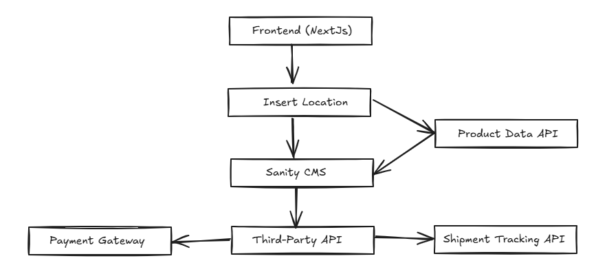

# 1. TECHNICAL REQUIREMENT:

## NAME THOUGHT FOR MY PROJECT AS:
 - Bendat: Transforming Self-Care on Demand.

## FRONTEND REQUIREMENTS:
 **Essentials Page***
 - Home
 - Location
 - Services List
 - TimeSlot
 - Order Confirmation
 - Checkout
 - Card Insertion
 - Appointments
 - Sign-in
 - Log-in

## SANITY CMS AS BACKEND:
 **How to use Sanity CMS***
 - Using Sanity CMS as a backend and database for this marketplace.

## THIRD PARTY API:
**This will use**
 - Payment Gateway - 
 - Shipment Tracking - 

# 2. DESIGN SYSTEM ARCHITECTURE:

**Diagram**

**Architecture Flow**

 1. A user visits the bendat frontend and click the 'Book Now' Button.
 2. That redirects user to '/location' page where user insert the location.
 3. If that location exists, then it sends the data to Sanity CMS.
 4. Services of that specific locations will be fetched and shown to user on '/services' page.
 5. User clicks the book with quantity and cart popup appears with quantity and total amounts with respective currency (PKR currently).
 6. User Selects the time for the service to get it avaialed.
 7. User SignIn/Login if user is not logged/signed in.
 8. User adds the card.
 9. Order Confirmation page displays for confirmation.
 10. Over clicking the 'Book Order' button to send the data to Sanity CMS.
 11. If the product is tangible then that info will be sent to Shipment Tracking System.

# 3. API REQUIREMENT:

 * **Endpoint Name**: /user
 * **Method**: POST
 * **Description**: Create a user's sign in.
 * **Response Format**: {"user_id": "123444", "user_name": "Abdul", "email": "abdul@gmail.com", "hashedpassword": "heno3823rgvncwce"}

 * **Endpoint Name**: /services-for-location
 * **Method**: GET
 * **Description**: Fetch services based on location entered by user.
 * **Response Format**: [{"service_id":123, service_name": "Salon", variations: [{"variation_id": "1234", "variation_name": "Salon General"},{"variation_id": "12345", "variation_name": "Salon Special"}]},{"service_id":12300, service_name": "Ear-Piercing", variations: [{"variation_id": "1234", "variation_name": "Ear-Piercing General"},{"variation_id": "12345", "variation_name": "Ear-Piercing Special"}]}]

 * **Endpoint Name**: /jobs
 * **Method**: POST
 * **Description**: Sends selected services with user info and time info in Sanity.
 * **Response Format**: [{"variation_id": "1234", "variation_name": "Salon General"},{"variation_id": "12340", "variation_name": "Ear-Piercing General"}]
