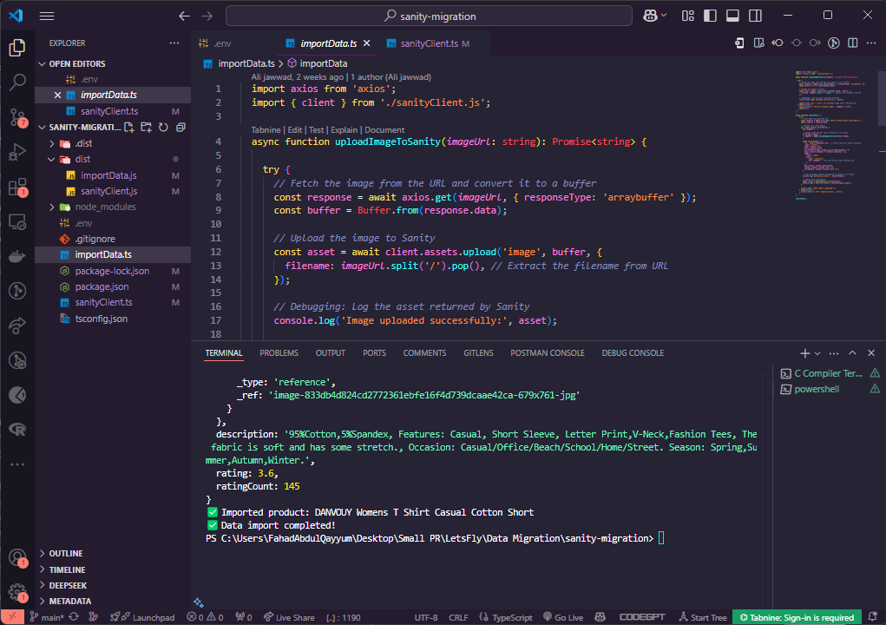
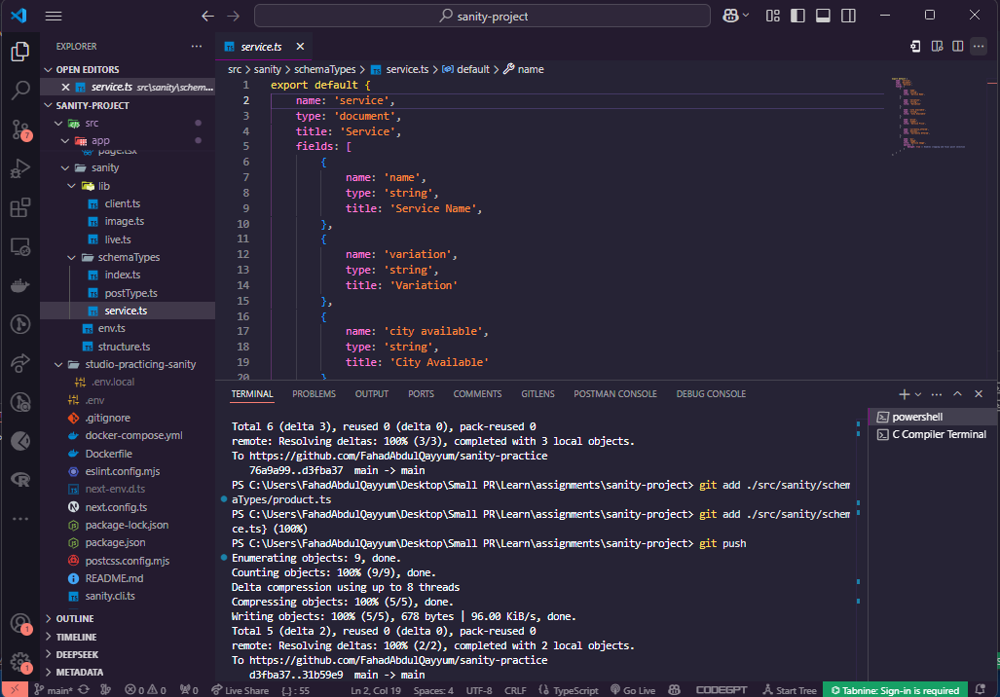
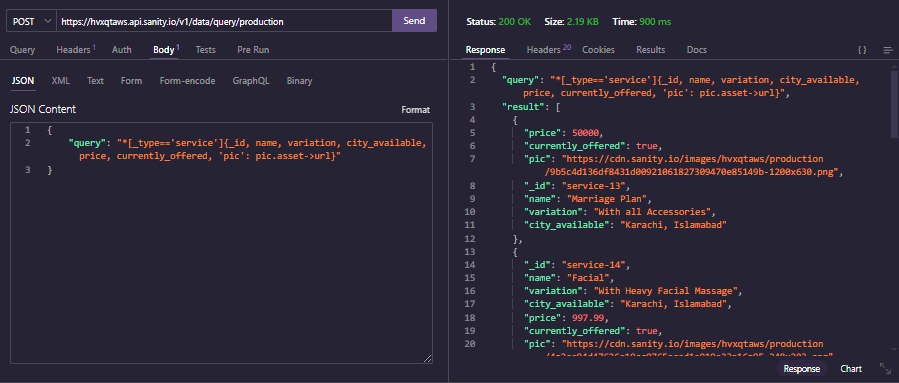
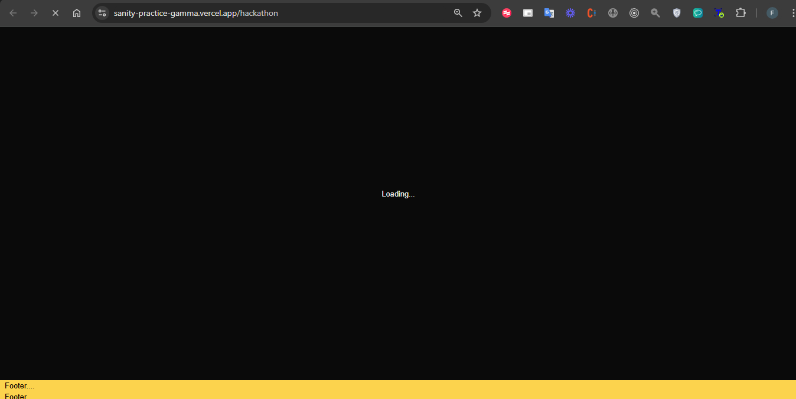

# Sanity Migration

**Data Sent to Sanity**

**Schema Modified As per my project**

**Images Reflected in frontend**

**API Tested with Data Fetched Successfully Using Thunder-Client Tool**

**Loader Appears while Data are Fetched Successfully**
