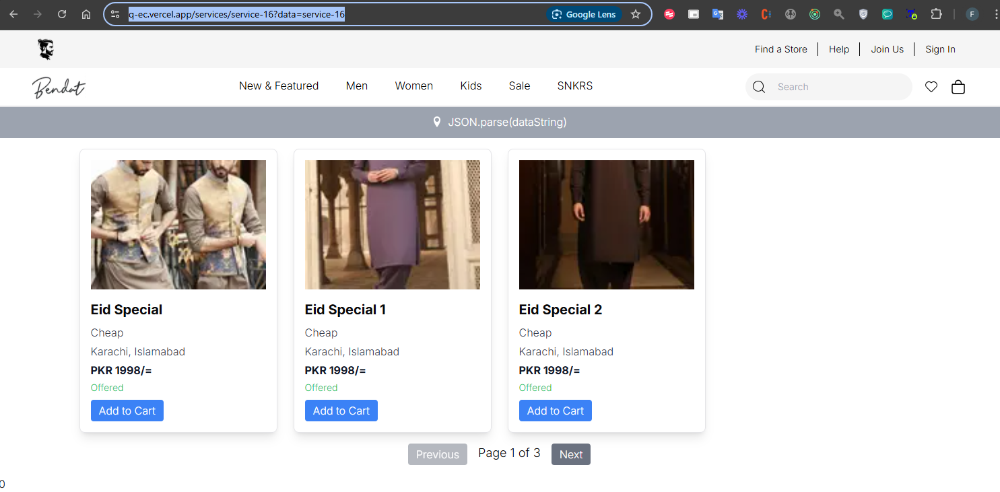
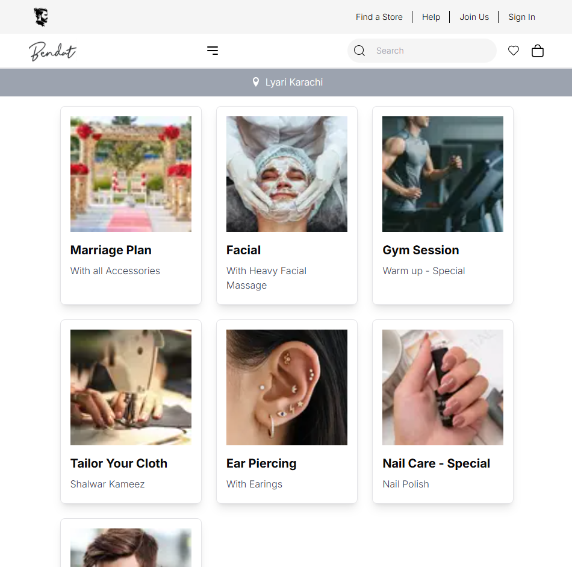
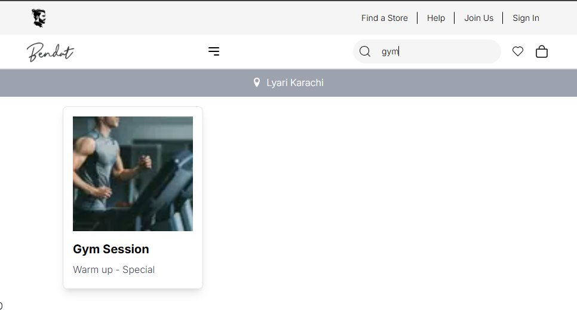
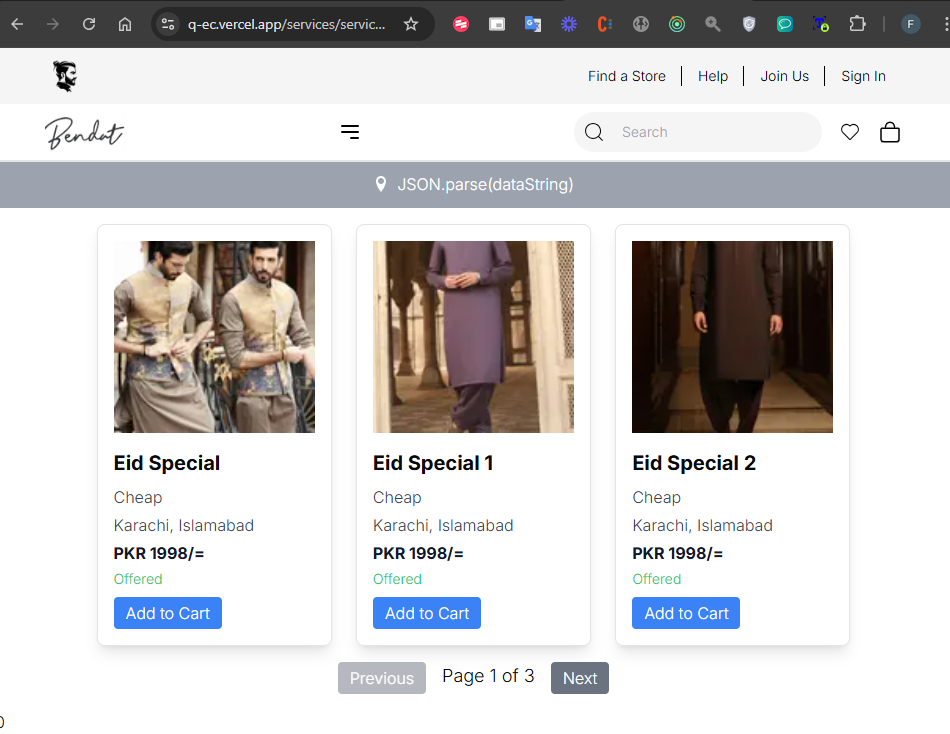
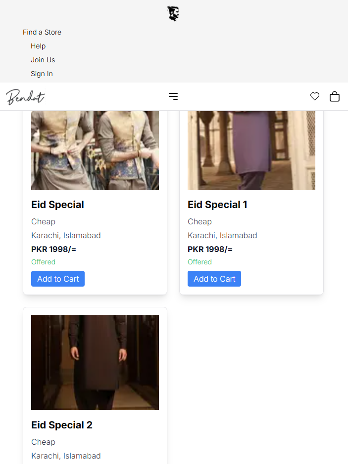
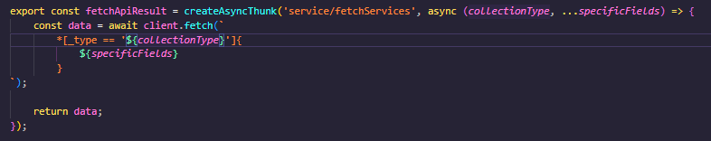

## Expected Output:

**1. A fully functional product listing page displaying dynamic data from Sanity CMS or APIs:**


**2. Individual product detail pages implemented using dynamic routing:**


**3.  Advanced category filters to refine and segment product views dynamically:**


**4. A search bar that eƯectively filters products by name or tags:**
Before Searching: 

After Searching: 

**5. Additional features like pagination and related products on detail pages:**


**6. Components styled to ensure responsiveness and a professional look across devices:**


**7. Modular and reusable components for future scalability:**


### CODE SNIPPETS ###

```bash
export const fetchApiResult = createAsyncThunk('service/fetchServices', async (collectionType, ...specificFields) => {
    const data = await client.fetch(`
        *[_type == '${collectionType}']{
            ${specificFields}
        }
`);

    return data;
});
```

```bash
// Products List
{
fetchedData
.map(service => (
                <div
                    key={service._id}
                    className="border rounded-lg p-4 shadow-lg"
                    onClick={() => handleRouter(service)}
                >
                    <Image
                        src={urlFor(service?.pic)?.url()}
                        alt={service.name}
                        width="120"
                        height="120"
                        className="w-full h-48 object-cover mb-4"
                    />
                    <h2 className="text-xl font-semibold mb-2">{service.name}</h2>
                    <p className="text-gray-700 mb-1">{service.variation}</p>

                </div>
            ))}
```


```bash
// Products Card
<div key={service._id} className="border rounded-lg p-4 shadow-lg">
              <Image
                src={
                  service?.pic?.asset?._ref
                    ? urlFor(service.pic.asset._ref).url()
                    : "https://fallback.image.url"
                }
                alt={service?.name || "Service Image"}
                width={120}
                height={120}
                className="w-full h-48 object-cover mb-4"
              />
              <h2 className="text-xl font-semibold mb-2">{service.name}</h2>
              <p className="text-gray-700 mb-1">{service.variation}</p>
              <p className="text-gray-700 mb-1">{service.city_available}</p>
              <p className="text-gray-900 font-bold mb-1">PKR {service.price}/=</p>
              <p
                className={`text-sm ${service.currently_offered ? "text-green-500" : "text-red-500"
                  }`}
              >
                {service.currently_offered ? "Offered" : "Not Offered"}
              </p>
              <button
                onClick={() => handleAddToCart(service)}
                className="mt-2 bg-blue-500 text-white py-1 px-3 rounded"
              >
                Add to Cart
              </button>
            </div>
```

```bash
// API Integration
export const fetchServices = createAsyncThunk('service/fetchServices', async () => {
    console.log('Fetching services...');
    const data = await client.fetch(`
        *[_type == 'service']{
            _id, 
            name, 
            variation, 
            city_available, 
            price, 
            currently_offered, 
            "pic": pic.asset->url
        }
    `);
    return data;
});
```
