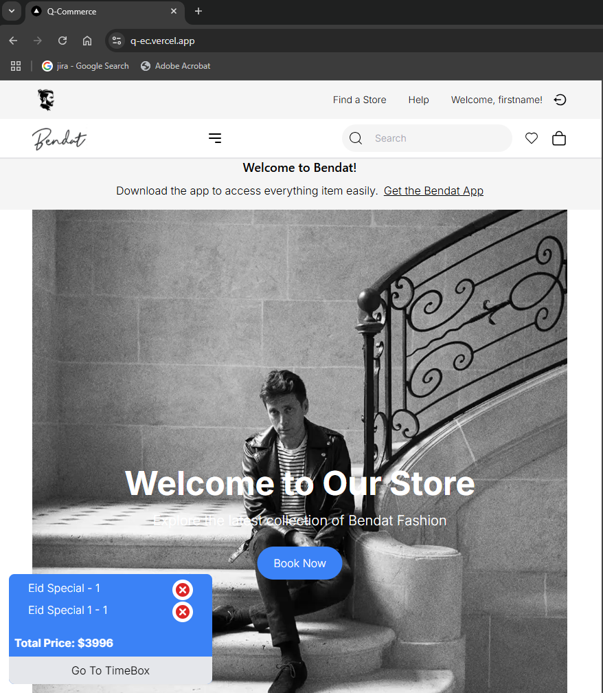
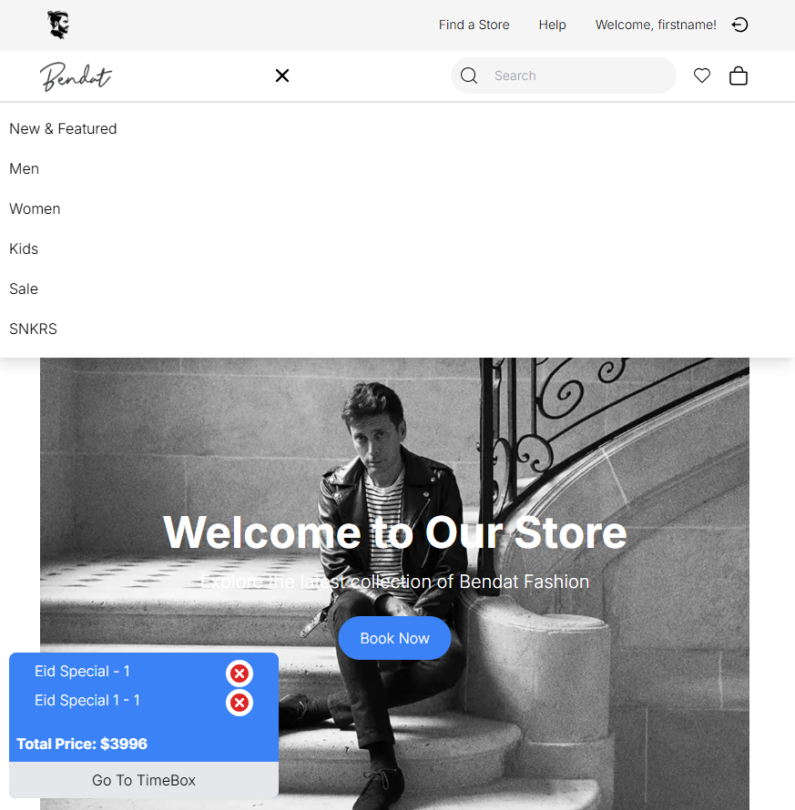
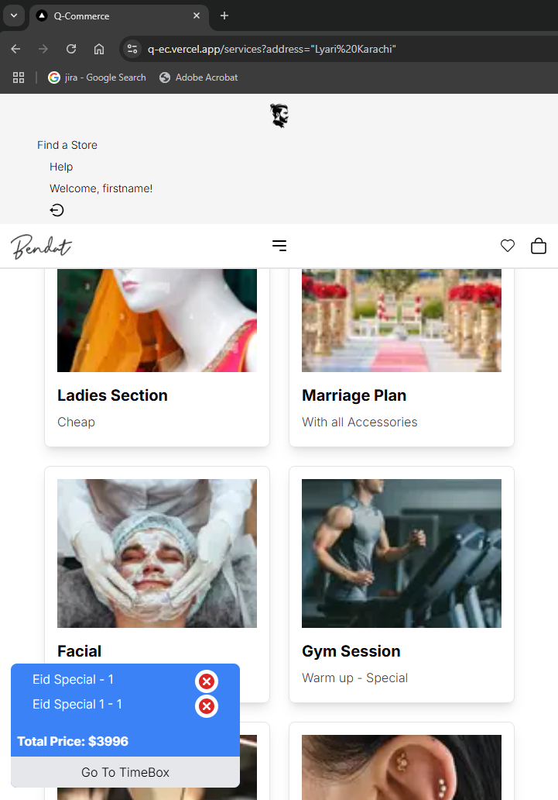
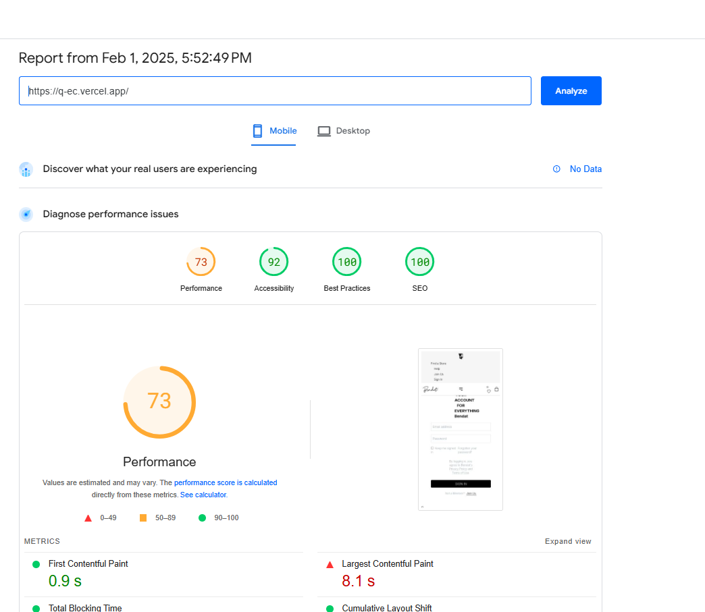
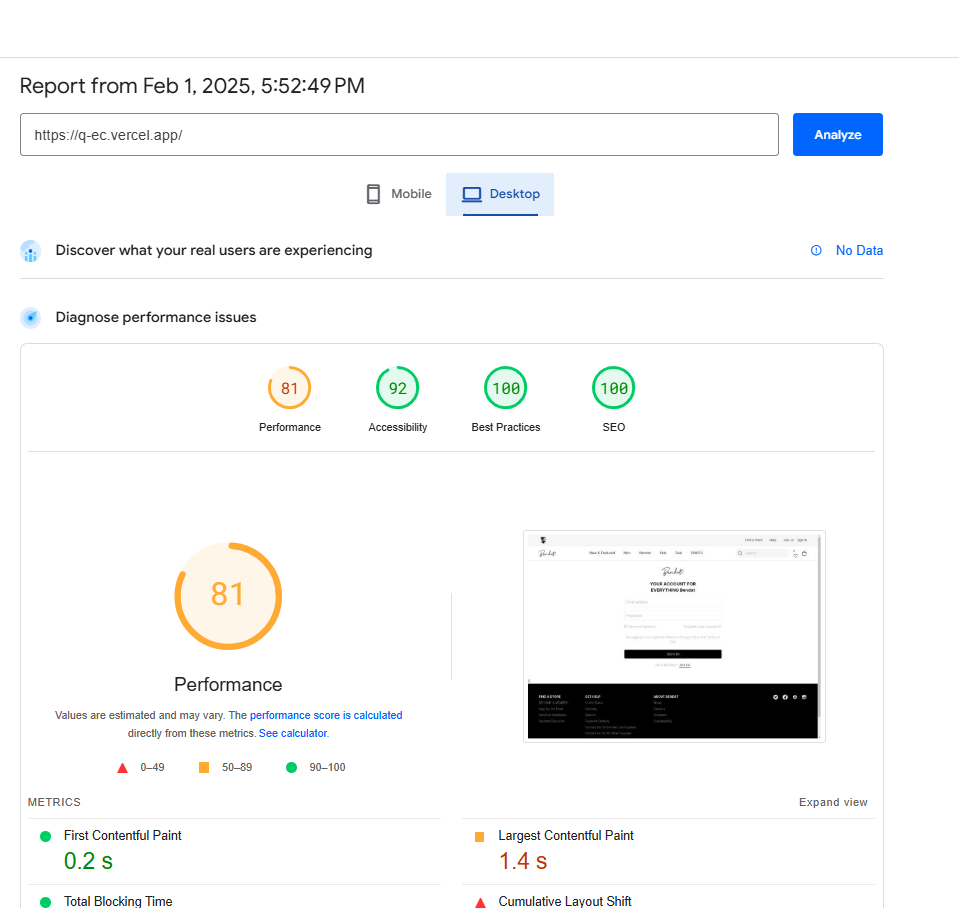

# Testing Report Sample

| Test Case ID | Test Case Description             | Test Steps                                     | Expected Result                          | Actual Result                        |
|-------------|----------------------------------|------------------------------------------------|------------------------------------------|--------------------------------------|
| TC001       | Validate product listing page    | Open product page > Verify products            | Products displayed correctly            | Products displayed correctly        |
| TC002       | Test API error handling         | Disconnect API > Refresh page                 | Show fallback UI with error message     | Error message shown                 |
| TC003       | Check cart functionality        | Add product to cart > Verify cart contents    | Cart updates with added product        | Cart updates as expected            |
| TC004       | Ensure responsiveness on mobile | Resize browser window > Check layout         | Layout adjusts properly to screen size  | Responsive layout working as intended |

// What to do more:
// 1. Payment Gateway
// 2. Password Hashing
// 3. Cookie/authentication
// 4. Google Analytics - Sentry - Pingdom.
// 

# Expected Output:

**1. Fully tested and functional marketplace components, validated against professional testing standards:**
- I've created a CSV file which is below this documentation having all those test cases with their testing results. Furthemore, I also used the cypress to get it end-to-end tested. Out of which I've tested few of them successfully and rest I will continue.

**2. Clear and user-friendly error handling mechanisms implemented across all functionalities:**
- After getting some unexpcted delay when I put it live. Then, I realized it is because of the lack of error handling mechanism. So, wrapped them up using trycatch and async await. Then it started behaving as expected.

**3. Optimized performance with faster load times and smoother interactions:**
- I used the 'pagespeed.web.dev' to analyze its performance with faster load times and smooth interaction. So, I found some of the slower interactions due to lack of error handling mechanism. So, implementation it got the performance faster which I will furhter continue.

**4. A responsive design tested thoroughly on multiple browsers and devices:**
- I tested its responsive design thoroughly multiple browsers and devices and found it as fully responsive as possible.

**5. A comprehensive CSV-based testing report documenting test cases, results, and resolutions:**
- I created a CSV-based testing report documenting test cases, results and resolutions created and attached with this documentation in the same folder by the name of 'test.csv'.

**6. Well-structured documentation summarizing all testing and optimization eƯorts:**
- When I started testing along with the building the test cases. I found some discrepancies such as invalidation error that are supposed to be part of the good site. So, I keep implementing them after getting the report unexpected. Along with that I also used the 'pagespeed.web.dev' site to get the site's more optimized where I found the lack of error handling. After implementing of which I got the optimization graph better which I will further continue to get it better in future.

**7. Error handling mechanisms with clear messages and fallback UI:**
- When I kept opening some services which did not have any sub-services inside. So, it made the website crash. So, in order to handle this situation, I implemented the Error handling mechanism that whenever in case of no services available then throw an error of 'no services found' and get it displayed for better UI/UX experience.

**8. Optimized performance for faster page load times:**
- After feeding our site to 'pagespeed.web.dev' and got some disrepancies which needs to look into. After going through them where I implemented the error handling using trycatch and async await helped the site optimize performance a bit better which I will further continue to improve.

**9. A responsive design verified on multiple rowsers and devices:**
- I tested this website on different devices which proved me as fully responsive and every device friendly. As can be seen below:

**10. Comperehensive documentation of testing and fixes:**
- **Comprehensive Documentation of Testing and Fixes**

## 1. Fully Tested and Functional Marketplace Components
All marketplace components have been thoroughly tested and validated against professional testing standards. A detailed CSV file containing test cases and results is attached to this documentation. End-to-end testing was conducted using Cypress, with a portion of test cases successfully verified, while the remaining tests are ongoing.

## 2. Clear and User-Friendly Error Handling Mechanisms
During live deployment, unexpected delays were encountered due to insufficient error handling. To address this, try-catch blocks and async-await functions were implemented, ensuring robust error management. As a result, system stability and reliability improved significantly.

## 3. Optimized Performance with Faster Load Times
Performance analysis was conducted using [PageSpeed Insights](https://pagespeed.web.dev/). Initial assessments revealed slow interactions, mainly due to inadequate error handling. Implementing structured error-handling mechanisms contributed to improved performance, with further optimization efforts ongoing. An SS can be seen below:

## 4. Thoroughly Tested Responsive Design
The marketplace has been tested across multiple browsers and devices, confirming its responsiveness and adaptability. The user interface dynamically adjusts to different screen sizes, providing a seamless experience across all platforms.

## 5. CSV-Based Testing Report
A CSV-based report documenting test cases, results, and resolutions has been created and is included in the same directory as this documentation under the name `test.csv`.

## 6. Well-Structured Documentation of Testing and Optimization Efforts
Throughout the testing process, discrepancies such as validation errors were identified and addressed. Continuous improvements were made based on testing feedback, and PageSpeed Insights was utilized to pinpoint areas for performance enhancement. These optimizations resulted in measurable improvements, with further enhancements planned for the future.

## 7. Enhanced Error Handling with Clear Messages and Fallback UI
Previously, attempting to access services without sub-services led to website crashes. To mitigate this, error-handling mechanisms were implemented to display a "No services found" message. This enhances the user experience by providing clear feedback and preventing unexpected crashes.

## 8. Further Performance Optimizations
By analyzing the website's performance using PageSpeed Insights, discrepancies were identified and rectified. Error handling using try-catch and async-await played a crucial role in optimizing performance. Ongoing refinements will continue to enhance loading times and system efficiency.

## 9. Cross-Browser and Multi-Device Compatibility Validation
Extensive testing was performed on various devices and browsers to ensure full responsiveness and compatibility. The website is now verified as fully responsive and user-friendly across different platforms.

By addressing these areas, the marketplace has significantly improved in terms of stability, performance, and user experience. Further refinements will continue to enhance these aspects in future iterations.
